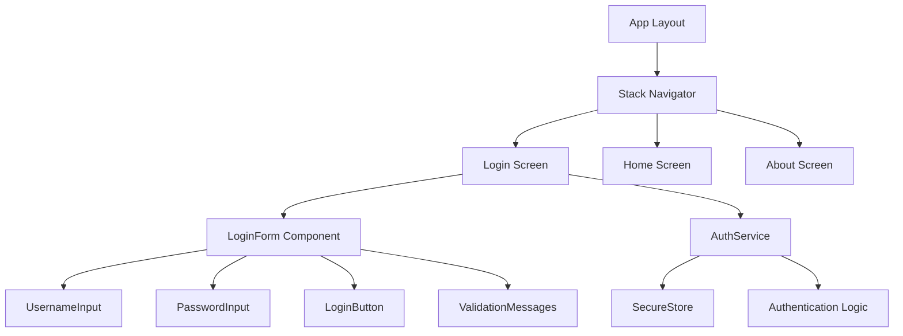
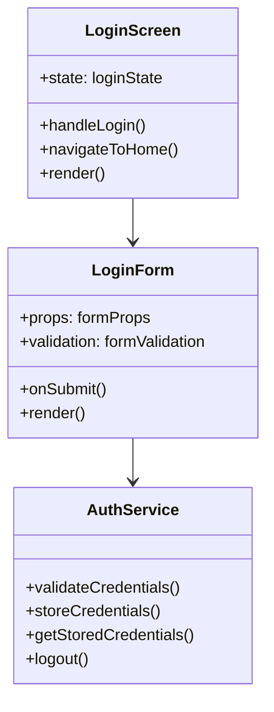
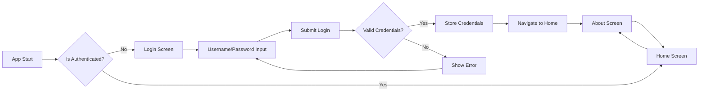
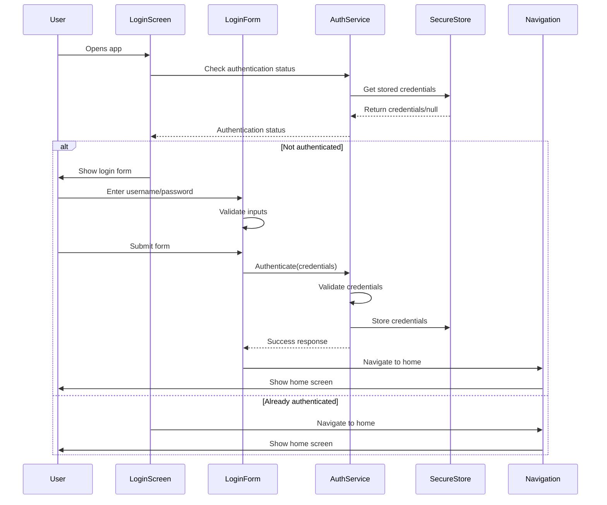

# Login Page Design Document

## Overview

This design document outlines the implementation of a login page feature for the React Native Expo project. The login page will provide username and password authentication functionality integrated with the existing Expo Router navigation system and NativeWind styling framework.

## Technology Stack & Dependencies

### Current Stack
- **Framework**: React Native with Expo SDK ~53.0.22
- **Navigation**: Expo Router ~5.1.5 (file-based routing)
- **Styling**: NativeWind ^4.1.23 (Tailwind CSS for React Native)
- **Language**: TypeScript ~5.8.3
- **UI Components**: React Native core components

### Additional Dependencies Required
- **expo-secure-store**: For secure credential storage
- **@expo/vector-icons**: For login form icons
- **react-hook-form**: For form validation and management
- **zod**: For schema validation

## Architecture

### Component Architecture



### File Structure
```
app/
├── _layout.tsx           # Root layout with navigation stack
├── index.tsx             # Home screen (protected)
├── about.tsx             # About screen (protected)
├── login.tsx             # New login screen
└── (auth)/               # Auth route group (optional organization)
    └── login.tsx         # Alternative location

components/
├── LoginForm.tsx         # Main login form component
├── AuthButton.tsx        # Reusable authentication button
└── FormInput.tsx         # Reusable form input component

services/
├── authService.ts        # Authentication logic
└── storageService.ts     # Secure storage operations

types/
└── auth.ts              # Authentication type definitions
```

## Component Architecture

### LoginScreen Component


### Component Hierarchy
```
LoginScreen
├── StatusBar
├── ScrollView
│   └── View (Container)
│       ├── Text (Title)
│       ├── LoginForm
│       │   ├── FormInput (Username)
│       │   ├── FormInput (Password)
│       │   ├── ValidationMessages
│       │   └── AuthButton (Login)
│       └── Text (Footer/Links)
```

### Props & State Management

#### LoginScreen State
```typescript
interface LoginState {
  isLoading: boolean;
  error: string | null;
  isAuthenticated: boolean;
}
```

#### LoginForm Props
```typescript
interface LoginFormProps {
  onSubmit: (credentials: LoginCredentials) => Promise<void>;
  isLoading: boolean;
  error?: string;
}

interface LoginCredentials {
  username: string;
  password: string;
}
```

## Routing & Navigation

### Navigation Flow


### Route Configuration
Update `app/_layout.tsx` to include login screen and authentication logic:

```typescript
// Route stack configuration
<Stack>
  <Stack.Screen 
    name="login" 
    options={{ 
      title: 'Login',
      headerShown: false 
    }} 
  />
  <Stack.Screen 
    name="index" 
    options={{ 
      title: 'Home',
      headerLeft: () => <LogoutButton />
    }} 
  />
  <Stack.Screen 
    name="about" 
    options={{ title: 'About' }} 
  />
</Stack>
```

### Authentication Guard
Implement route protection logic to redirect unauthenticated users to login screen.

## Styling Strategy

### NativeWind Classes Structure
```typescript
const styles = {
  container: 'flex-1 bg-gray-50 justify-center px-6',
  card: 'bg-white p-6 rounded-xl shadow-sm mx-4',
  title: 'text-3xl font-bold text-gray-900 text-center mb-8',
  input: 'border border-gray-300 rounded-lg px-4 py-3 text-base mb-4',
  inputFocused: 'border-blue-500',
  inputError: 'border-red-500',
  button: 'bg-blue-600 py-3 rounded-lg mb-4',
  buttonPressed: 'bg-blue-700',
  buttonDisabled: 'bg-gray-400',
  buttonText: 'text-white text-center font-semibold text-base',
  errorText: 'text-red-600 text-sm mb-4',
  linkText: 'text-blue-600 text-center mt-4'
};
```

### Responsive Design Considerations
- Keyboard-aware scrolling for form inputs
- Safe area handling for different device sizes
- Proper touch targets (minimum 44px)
- Loading states and feedback

## State Management

### Authentication Context
```typescript
interface AuthContextType {
  isAuthenticated: boolean;
  user: User | null;
  login: (credentials: LoginCredentials) => Promise<void>;
  logout: () => Promise<void>;
  isLoading: boolean;
}
```

### Local State Management
- Form state managed by react-hook-form
- Authentication state managed by React Context
- Persistent storage using expo-secure-store

## API Integration Layer

### Authentication Service Interface
```typescript
interface AuthService {
  validateCredentials(username: string, password: string): Promise<AuthResult>;
  storeCredentials(credentials: LoginCredentials): Promise<void>;
  getStoredCredentials(): Promise<LoginCredentials | null>;
  clearStoredCredentials(): Promise<void>;
}

interface AuthResult {
  success: boolean;
  user?: User;
  error?: string;
}
```

### Mock Authentication Implementation
For development purposes, implement a mock authentication service:
- Predefined valid username/password combinations
- Simulated API delay
- Error scenarios for testing

## Form Validation

### Validation Schema (Zod)
```typescript
const loginSchema = z.object({
  username: z.string()
    .min(3, 'Username must be at least 3 characters')
    .max(20, 'Username must be less than 20 characters'),
  password: z.string()
    .min(6, 'Password must be at least 6 characters')
    .max(50, 'Password must be less than 50 characters')
});
```

### Validation Rules
- **Username**: Required, 3-20 characters, alphanumeric
- **Password**: Required, 6-50 characters, any characters
- **Real-time validation**: On blur and on submit
- **Error display**: Below each input field

## Security Considerations

### Data Protection
- Use expo-secure-store for credential storage
- Never store passwords in plain text
- Implement proper session management
- Add biometric authentication option (future enhancement)

### Input Sanitization
- Validate all inputs on client side
- Prepare for server-side validation integration
- Prevent common injection attacks

## Testing Strategy

### Unit Testing Focus Areas
1. **LoginForm Component**
   - Form submission with valid data
   - Form validation error handling
   - Input field interactions
   - Loading states

2. **AuthService**
   - Credential validation logic
   - Secure storage operations
   - Error handling scenarios

3. **Navigation Logic**
   - Authentication state routing
   - Protected route access
   - Login/logout navigation flow

### Test Scenarios
```typescript
// Example test cases
describe('LoginForm', () => {
  test('validates required fields');
  test('shows error for invalid credentials');
  test('navigates to home on successful login');
  test('displays loading state during authentication');
  test('handles network errors gracefully');
});
```

## User Experience Flow

### Login Process


### Error Handling
- Invalid credentials: Display error message below form
- Network errors: Show retry option
- Form validation: Real-time field-level errors
- Loading states: Disable form during authentication

## Implementation Priority

### Phase 1: Core Login Functionality
1. Create login screen component
2. Implement basic form with validation
3. Add mock authentication service
4. Integrate with navigation system

### Phase 2: Enhanced UX
1. Add secure storage integration
2. Implement loading and error states
3. Add form accessibility features
4. Polish visual design

### Phase 3: Advanced Features
1. Remember me functionality
2. Biometric authentication option
3. Password reset flow
4. Multi-factor authentication support